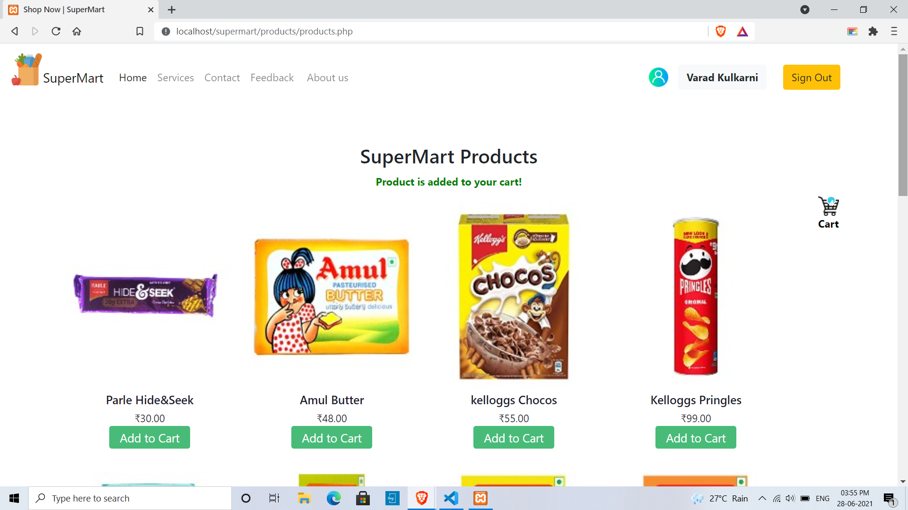
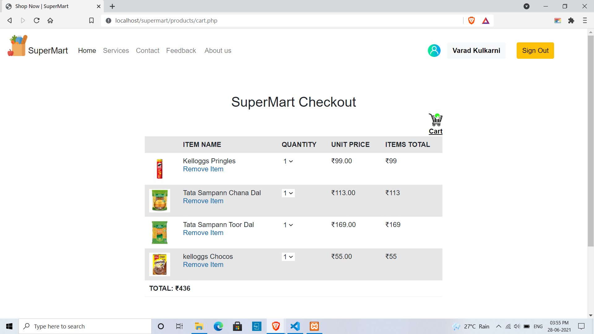
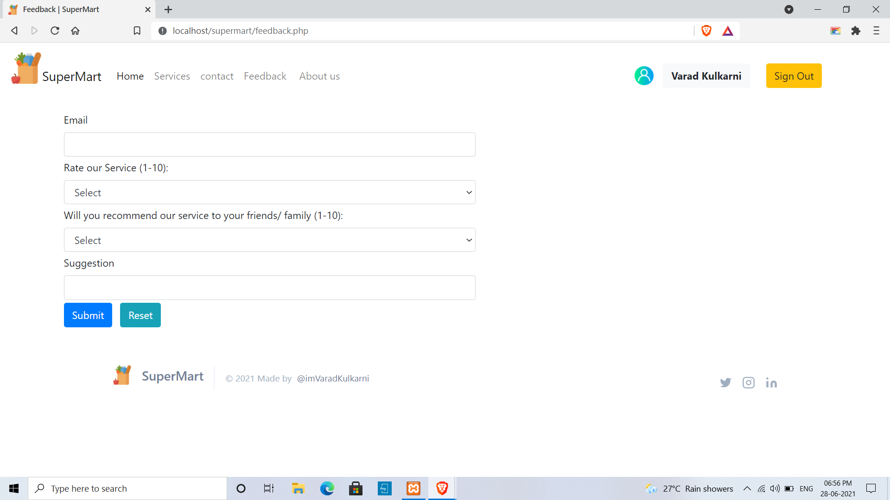
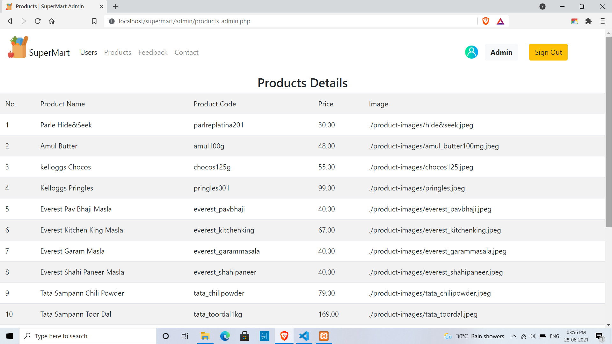

# Documentation

#### *SuperMart* is web application project.

 **Frontend:** HTML,CSS,BOOTSTRAP,TAILWINDCSS  
 **Backend:** PHP *(Procedual Approach)*  
 **Database:** MySQL  

 ## No. of Modules:
 1. [User Module](#1-User-Module)  
    1.1. [Sign Up](#11-Sign-Up)  
    1.2. [Login](#12-Login)  
    1.3. [Home Page](#13-Home-Page)  
    1.4. [Products](#14-Products)  
    1.5. [Cart](#15-Cart)  
    1.6. [Feedback](#16-Feedback)  
    1.7. [Contact](#17-Contact)  
    1.8. [My Account](#18-My-Account)  

 2. [Admin Module](#2-Admin-Module)  
    2.1. [Users](#21-Users)  
    2.2. [Products](#22-Products)  
    2.3. [Feedback](#23-Feedback)  
    2.4. [Contact](#24-Contact)  

# 1. User Module
### 1.1. Sign Up
  
### 1.2. Login
  
### 1.3. Home Page
  
### 1.4. Products
  
### 1.5. Cart
  
### 1.6. Feedback
*Requires Login*  
  
### 1.7. Contact
  
### 1.8. My Account
  

# 2. Admin Module
### 2.1. Users
*Requires Login*  
  

### 2.2. Products
*Requires Login*  
  

### 2.3. Feedback
*Requires Login*  
  

### 2.4. Contact
*Requires Login*  
  

