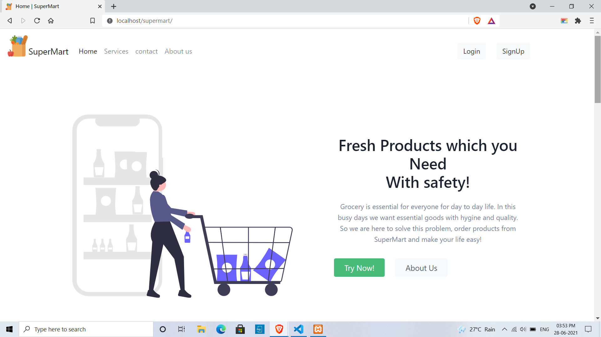

# Documentation

#### *SuperMart* is web application project.

 **Frontend:** HTML,CSS,BOOTSTRAP,TAILWINDCSS  
 **Backend:** PHP *(Procedual Approach)*  
 **Database:** MySQL  

 ## No. of Modules:
 1. [User Module](#1-User-Module)  
    11. [Sign Up](#11-Sign-Up)  
    12. [Login](#12-Login)  
    13. [Home Page](#13-Home-Page)  
    14. [Products](#14-Products)  
    15. [Cart](#15-Cart)  
    16. [Feedback](#16-Feedback)  
    17. [Contact](#17-Contact)  
    18. [My Account](#18-My-Account)  

 2. [Admin Module](#2-Admin-Module)  
    21. [Users](#21-Users)  
    22. [Products](#22-Products)  
    23. [Feedback](#23-Feedback)  
    24. [Contact](#24-Contact)  

# 1. User Module

# 2. Admin Module

